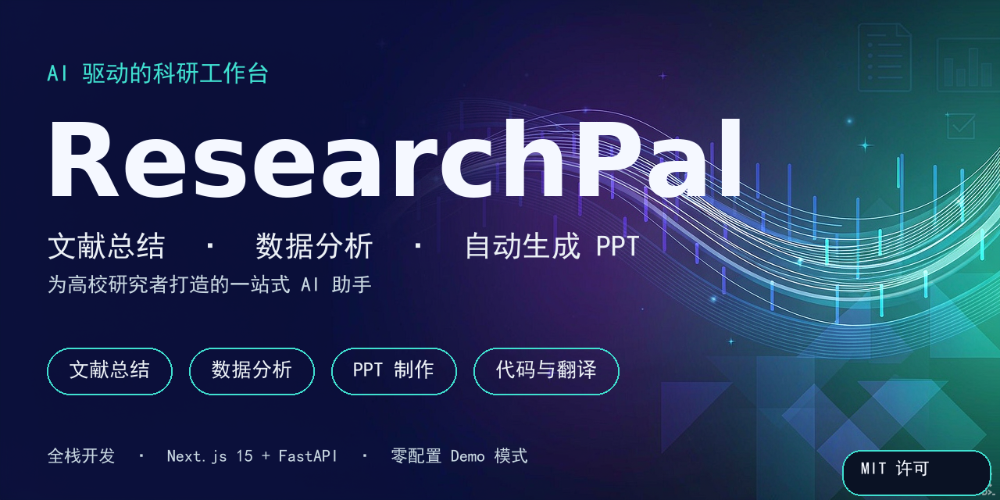
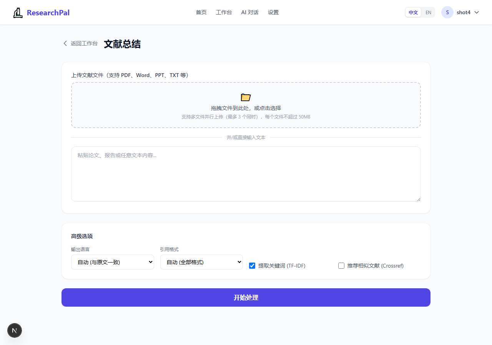
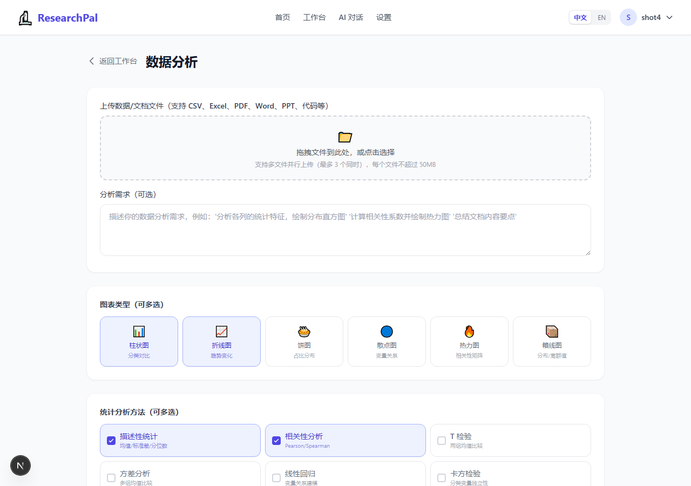
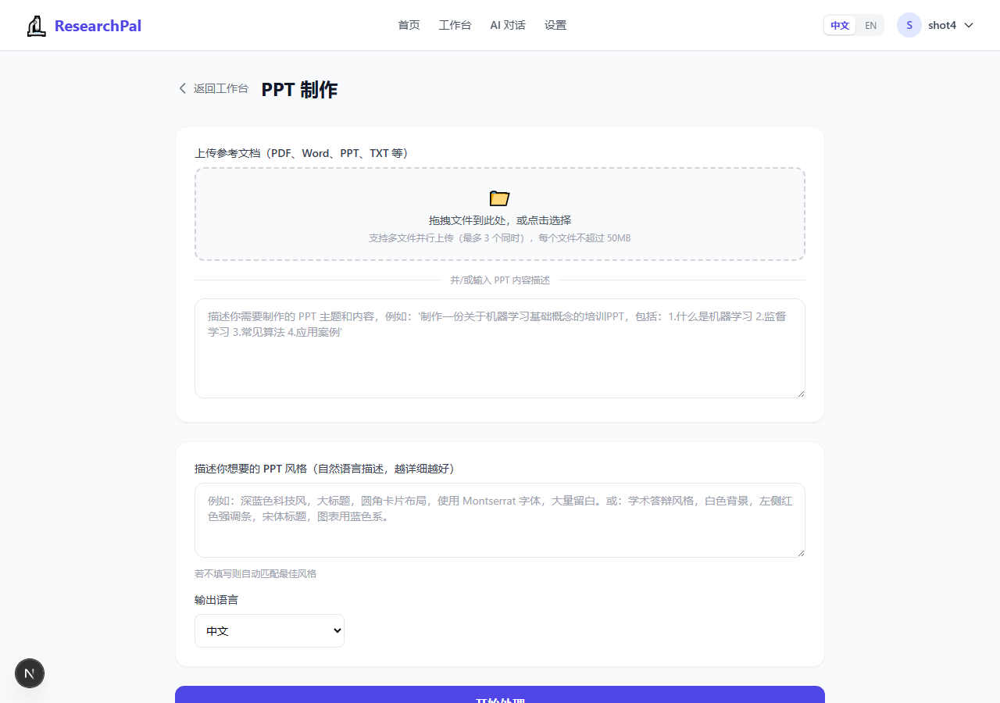
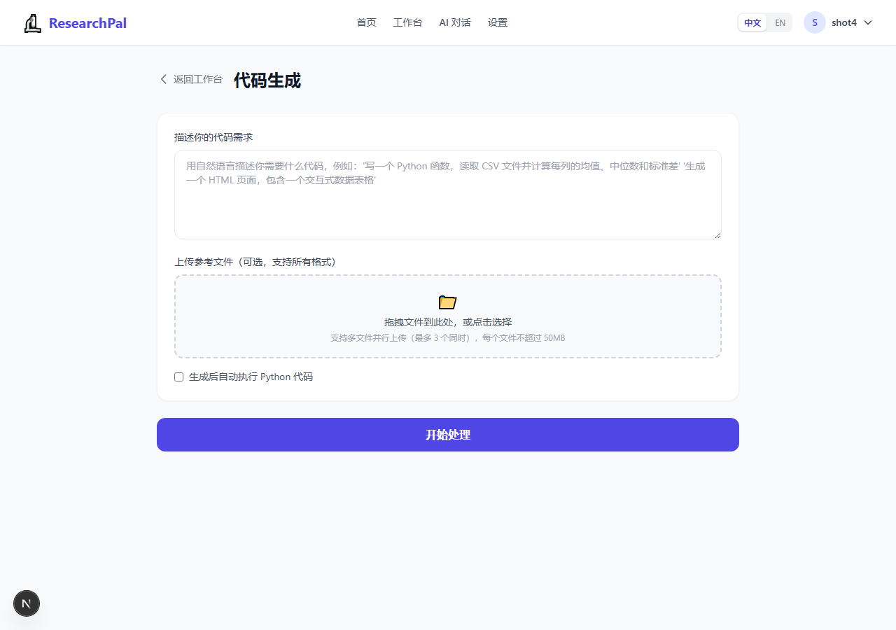
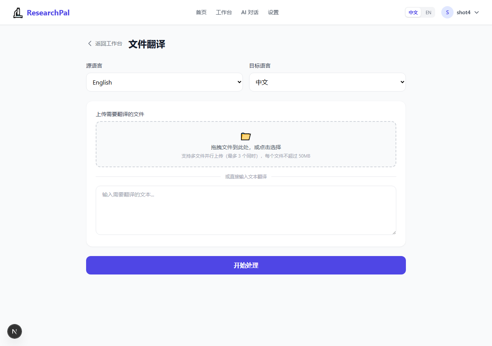
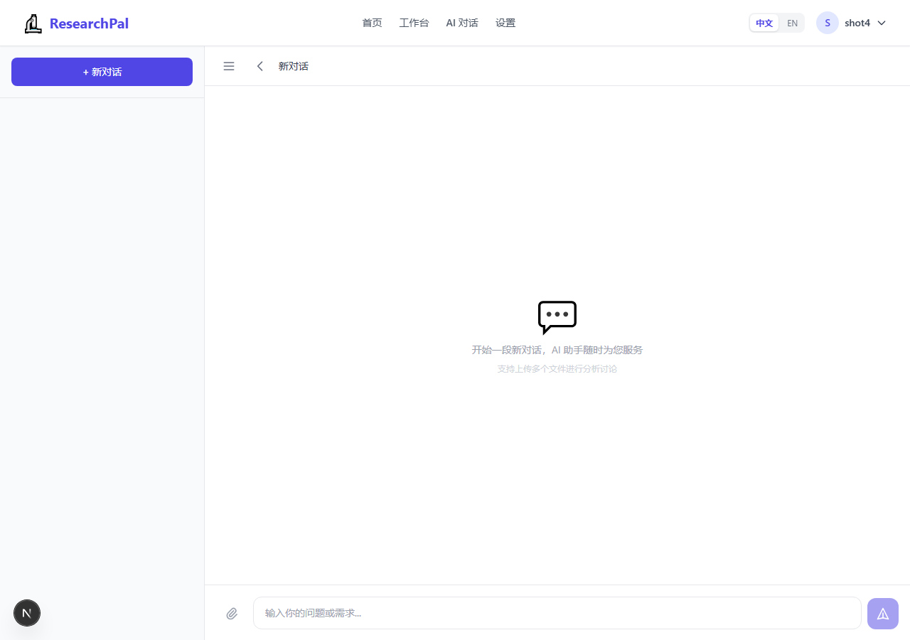
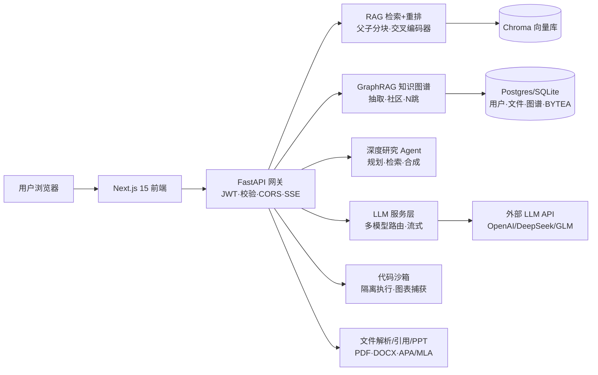
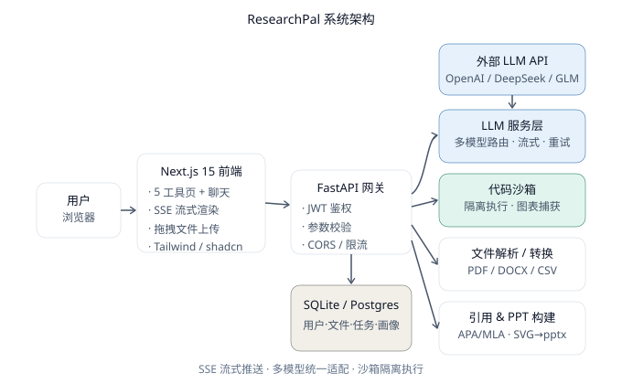

<p align="center">
  
</p>

<p align="center">
  <a href="https://researchpal-inky.vercel.app">
    
  </a>
  &nbsp;
  <a href="https://github.com/AAly030120/ResearchPal">
    
  </a>
</p>

<p align="center">
  <a href="#-快速开始"><strong>▶ 本地一键体验（无需 API Key）</strong></a>
  &nbsp;·&nbsp;
  <a href="docs/DEMO_SCRIPT.md">🎬 演示剧本</a>
  &nbsp;·&nbsp;
  <a href="docs/PRODUCT.md">📋 产品决策</a>
  &nbsp;·&nbsp;
  <a href="docs/INTERVIEW.md">🎤 面试故事库</a>
  &nbsp;·&nbsp;
  <a href="docs/HARDENING.md">🛡️ 工程加固</a>
</p>

# ResearchPal · AI 科研助手

> 面向高校学生的 **AI 驱动科研工作台**——把文献阅读、数据分析、报告撰写、演示制作等繁琐学术流程，一站式自动化。

[](https://nextjs.org/)
[](https://fastapi.tiangolo.com/)
[](https://www.python.org/)
[](#license)
[](#%E5%BF%AB%E9%80%9F%E5%BC%80%E5%A7%8B)

## 📑 目录

- [这是什么](#这是什么)
- [🖼️ 界面预览](#-界面预览)
- [功能特性](#功能特性)
- [系统架构](#系统架构)
- [技术栈](#技术栈)
- [🚀 快速开始](#-快速开始)
- [目录结构](#目录结构)
- [工程亮点](#工程亮点)
- [文档导航](#文档导航)
- [Roadmap](#roadmap)
- [License](#license)

---

## 这是什么

ResearchPal 是一款 **全栈 AI 产品**：用户上传论文 / 数据 / 文档，平台调用大语言模型完成**文献总结、数据分析与图表、一键生成 PPT、代码生成、文件翻译**五大任务，并配备账号体系、多模型切换与个性化记忆。

它既是可用的科研工具，也是一个展示 **AI 产品设计 + 工程落地** 能力的作品项目。关于背后的用户研究、功能优先级、模型选型权衡与成功指标，见 [**PRODUCT.md**](docs/PRODUCT.md)。

> 🚀 **在线 Demo**：[researchpal-inky.vercel.app](https://researchpal-inky.vercel.app)
> 后端由 GitHub Actions 每 10 分钟保活，点开即用、无需等待冷启动。
> AI 功能采用「自带密钥」模式 —— 在**设置**页填入任意一家模型 Key 即可（OpenAI / DeepSeek / 智谱 GLM / 通义千问）。
>
> 🎬 **给面试官 / 项目评审**：5 分钟演示流程、高频追问预案与翻车救场顺序，见 [**DEMO_SCRIPT.md**](docs/DEMO_SCRIPT.md)。

---

## 🖼️ 界面预览

**落地页** —— 一句话讲清价值主张，5 秒决定要不要注册。


**五大工具**（已登录真实界面）：

| | |
| :---: | :---: |
| **📄 文献总结** — 上传 PDF/Word，一键结构化摘要 + 多种引用格式<br> | **📊 数据分析** — 上传 CSV/Excel，LLM 生成代码 → 沙箱执行出图<br> |
| **🎨 PPT 制作** — 自然语言描述风格，自动生成 `.pptx`<br> | **💻 代码生成** — 自然语言需求 → 代码 → 一键执行<br> |
| **🌐 文件翻译** — PDF/Word 保留原排版的中英互译<br> | **💬 AI 对话** — 基于历史任务的个性化记忆<br> |

---

## 功能特性

| 功能 | 说明 |
| --- | --- |
| 📄 **文献总结** | 上传 PDF / Word，输出结构化摘要、关键贡献、方法学与文献元数据，支持中/英输出与多种引用格式 |
| 📊 **数据分析** | 上传 CSV / Excel，LLM 生成 pandas 分析代码 → 隔离沙箱执行 → 捕获图表与统计摘要 |
| 🎨 **PPT 制作** | 自然语言描述风格，自动生成大纲与配色，导出可编辑的 `.pptx`（6 种版式，零依赖可降级） |
| 💻 **代码生成** | 自然语言需求生成 Python 代码，可一键在沙箱中执行并返回结果 |
| 🌐 **文件翻译** | 支持 PDF / Word / 文本，保留原排版结构的中英互译 |
| 💬 **AI 对话** | 基于历史任务的个性化记忆，越用越懂你 |
| 🧠 **RAG 检索增强** | 父子分块（小片段检索 + 大片段生成）+ 交叉编码器重排（fastembed bge-reranker，缺失时自动降级启发式）+ jieba 关键词融合；回答带 `[来源: 文件名 第N页 #片段M]` 页码级引用，可一键开关 |
| 🕸️ **知识图谱 GraphRAG** | 抽取文献实体与关系构建知识图谱，对话时沿图谱 N 跳扩展检索上下文，回答带实体级引用；可一键开关、支持单文件范围 |
| 🔬 **深度研究 Agent** | 自动规划研究子问题 → 多源检索（向量 RAG + 知识图谱）→ 逐章合成报告 → 附参考来源；适合开题 / 文献综述 |
| 🔑 **多模型路由** | 统一适配 OpenAI / DeepSeek / 智谱 GLM / 通义千问，前端一键切换 |
| 👤 **账号体系** | 邮箱注册登录、JWT 鉴权、文件与任务历史与账号绑定 |

---

## 系统架构





> 完整数据流与模块职责见 [**PRODUCT.md · 技术架构**](docs/PRODUCT.md#技术架构与关键决策)。

---

## 技术栈

| 层 | 技术 |
| --- | --- |
| 前端 | Next.js 15 (App Router) · React 19 · Tailwind CSS · shadcn/ui · SSE 流式 |
| 后端 | FastAPI · SQLAlchemy 2.0 · python-jose (JWT) · bcrypt |
| AI | OpenAI / DeepSeek / 智谱 GLM / 通义千问（统一 OpenAI-compatible 适配）· tenacity 重试 |
| 文件 | pdfplumber · python-docx · pandas · openpyxl |
| 图表 | matplotlib · seaborn（沙箱内执行） |
| 演示 | python-pptx（内置渲染器，可选 ppt-master 提升保真度） |
| 部署 | Render（`render.yaml` 已就绪）· 支持 Docker |

---

## 快速开始

### 方式一：零配置体验（推荐先试）

```bash
# 1. 后端
cd backend
python -m venv .venv && source .venv/Scripts/activate   # Windows: .venv\Scripts\activate
pip install -r requirements.txt
uvicorn app.main:app --port 8000

# 2. 前端（另开一个终端）
cd frontend
npm install
echo "NEXT_PUBLIC_API_URL=http://localhost:8000" > .env.local
npm run dev
```

打开 `http://localhost:3002`，**不填任何 API Key** 即可：
- 注册 / 登录账号
- 跑通全部 5 个工具（总结 / 分析 / PPT / 代码 / 翻译）
- 下载真实的 `.pptx`、查看真实的分析图表（沙箱执行）

> 未配置 Key 时进入 **Demo 模式**：结构化任务返回示例结果，数据分析仍会在隔离沙箱中真实运行并出图，方便评审人一键体验产品闭环。

### 方式二：接入真实大模型

复制 `backend/.env.example` 为 `backend/.env`，填入至少一个模型的 API Key（如 `DEEPSEEK_API_KEY`），重启后端即可切换为真实 AI 输出。模型可在前端「设置」页随时切换。

---

## 目录结构

```
researchpal/
├── backend/                 # FastAPI 后端
│   ├── app/
│   │   ├── api/             # 路由层（auth/files/tasks/chat/settings）
│   │   ├── core/            # 配置、安全、密钥管理
│   │   ├── models/          # SQLAlchemy 模型
│   │   ├── schemas/         # Pydantic 模式
│   │   └── services/        # 业务逻辑（LLM/沙箱/PPT/引用/翻译/记忆/Demo）
│   └── requirements.txt
├── frontend/                # Next.js 前端
│   └── src/app/             # 页面（工具页 / 聊天 / 账号 / 设置）
├── docs/
│   ├── architecture.svg     # 架构图
│   ├── PRODUCT.md           # 产品决策文档
│   └── INTERVIEW.md         # 简历要点 & 面试题回答库
├── render.yaml              # 一键部署（Render）
└── .gitignore
```

---

## 工程亮点

- **多模型统一适配**：所有 provider 适配为 OpenAI-compatible 接口，切换成本为零；前端可热切换，后端自动回退到首个可用 Key。
- **代码沙箱隔离**：数据分析 / 代码执行在受限子进程中运行，禁用危险模块、限制超时，捕获 stdout 与图表，安全可审计。
- **引用格式严谨**：`citation_service` 实现 APA / MLA / Chicago / GB7714 四种规范，按规范严格格式化。
- **PPT 零依赖可降级**：内置 python-pptx 渲染器，缺失可选 ppt-master 时自动降级，克隆即跑、绝不崩。
- **个性化记忆**：`memory_service` 随使用积累用户风格与领域偏好，注入后续 LLM 提示词，产品越用越聪明。
- **Demo 模式**：无 Key 也能完整演示，降低评审与协作门槛。
- **RAG 检索增强**：上传文献自动切片 → 向量化（本地 fastembed 或 DashScope text-embedding-v3）→ 存入 Chroma，对话时做「稠密向量 + jieba 关键词」混合重排，注入带引用的上下文；用户隔离、可一键开关、支持单文件范围检索。
- **父子分块 + 交叉编码器重排（Top-1/2 RAG 增强）**：子块用于向量检索、父块作为生成上下文窗口，缓解长文截断；检索后用 fastembed `bge-reranker-v2-m3` 交叉编码器重排 Top-N，模型缺失时优雅降级为「余弦 + jieba 关键词」启发式，零外部依赖也能跑（已写单测锁定）。
- **知识图谱 GraphRAG（融合 LitKG）**：从文献抽取 10 类实体 / 10 类关系存入 Postgres + NetworkX，对话时沿图谱 N 跳扩展、Louvain 社区发现 + LLM 主题摘要；把另一个知识图谱项目的核心能力直接复用到本平台（已写单测锁定 N 跳扩展）。
- **深度研究 Agent（Top-3 RAG 增强）**：规划子问题 → 并行检索向量库与知识图谱 → 逐章流式合成 → 自动汇总参考来源；SSE 实时进度，前端可一键开启（已写单测锁定 pipeline）。

---

## 部署（Render + Postgres 持久化）

> **为什么需要 Postgres？** Render 的 Free 实例文件系统是**临时**的：每次重启 / 冷启动，本地磁盘（`uploads/`、`outputs/`、`chroma_store/`、以及默认的 SQLite 库文件）都会被清空。这会造成「注册的账号、对话记录、已索引文献全部丢失」——正是早期 SQLite 方案的致命问题。

解决方式（已内置，开箱即用）：

1. **结构化数据 → Postgres**：通过 `DATABASE_URL` 接入 Render 免费 Postgres（独立托管服务，不受实例重启影响），账号、文件元数据、对话、任务全部持久化。
   - **Blueprint 部署**：`render.yaml` 已声明 `databases` 并用 `fromDatabase` 自动注入 `DATABASE_URL`，无需手动配置。
   - **手动 Web Service**：在 Render 控制台为该服务添加 Postgres 插件，并设环境变量 `DATABASE_URL=<连接串>`。
2. **上传文件原始字节 → 存进 Postgres `BYTEA`**：`File.data` 列保存文件内容，重启后由 `materialize_file()` 自动从 BLOB 还原到磁盘，无需重新上传。
3. **Chroma 向量库 → 启动自愈**：向量存在临时磁盘，重启会被清空；服务启动后后台线程 `heal_indexes()` 会自动为「标记为已索引但向量缺失」的文件重建索引。
4. **完全不丢盘（可选，付费）**：升级到 Starter 方案并挂载 **Persistent Disk**，将磁盘挂到后端工作目录，则 `uploads/`、`outputs/`、`chroma_store/` 全部持久化（代码无需改动，相对路径已适配）。

前端部署：Vercel 导入本仓库前端（`frontend/`），构建命令 `npm run build`、输出目录 `out`、环境变量 `NEXT_PUBLIC_API_URL=<后端地址>`。

> **注意**：Render 免费 Postgres 有「90 天无访问自动暂停/删除」策略，面试演示前请先访问一次后端 `/api/health` 唤醒。

---

## 文档导航

- [PRODUCT.md](docs/PRODUCT.md) — 用户研究、功能优先级、模型选型成本权衡、成功指标、AI 安全与学术诚信
- [INTERVIEW.md](docs/INTERVIEW.md) — 简历要点写法 + 高频面试题回答库（为什么做 / 最大权衡 / 如何度量 / AI 安全思考）
- [INTERVIEW_STORIES.md](docs/INTERVIEW_STORIES.md) — STAR 故事库：Render 持久化翻车 / PAT 作用域 / Python 版本锁 / 沙箱逃逸 / GraphRAG 权衡
- [DEMO_SCRIPT.md](docs/DEMO_SCRIPT.md) — 5 分钟现场演示剧本 + 翻车救场顺序（含 Plan B 录屏）
- [PROD_DEMO_SETUP.md](docs/PROD_DEMO_SETUP.md) — 线上运行时配置（Render 环境变量 + `SEED_DEMO=1` 自动预置演示账号）
- [GITHUB_LAUNCH.md](docs/GITHUB_LAUNCH.md) — 推送前的门面清单：About 文案 / Topics / 社交预览图上传步骤 / 推送 checklist
- [架构图](docs/architecture.svg)
- `backend/scripts/bench_rag.py` — 离线可跑的 RAG/重排/GraphRAG 效果评测（产出 Recall@K 与 MRR 量化指标）

---

## Roadmap

- [x] 基于上传文档的 RAG 多轮问答（已落地：RAG 检索增强 + 图谱增强 + 深度研究）
- [x] GraphRAG 知识图谱（已融合 LitKG：实体/关系抽取 + N 跳检索 + 社区发现）
- [x] 交叉编码器重排 + 父子分块（Top-3 RAG 增强，已写单测）
- [ ] 任务队列（Celery + Redis）支持大文件后台异步
- [ ] 管理后台：模型 Key 管理与用量统计
- [ ] 更多引用格式与期刊模板

---

## License

[MIT](LICENSE) © ResearchPal
